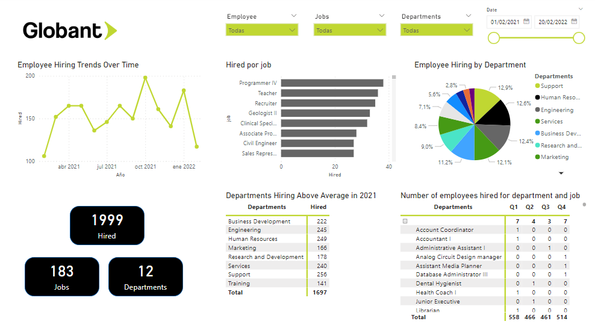

# Data Challenge: globant_code_challenge_isantrich

This project facilitates the seamless migration of historic data from CSV files to a new SQL database system. The database, hosted on Amazon RDS, utilizes MySQL. Additionally, it includes the development of a REST API service to manage new data transactions, backups, and restoration processes efficiently.

### Key Features:

- **Data Migration:** Transfer historic data from CSV files to a MySQL database system hosted on Amazon RDS, ensuring accuracy and completeness.

- **REST API Service:** Create an API service to handle new data transactions, including validation and insertion according to predefined data dictionary rules. One of the validations is to restrict the insertion of records exceeding 1000 rows per request, ensuring optimal performance. Moreover, transactions must adhere to the project's data model.

- **Backup and Restoration:** Implement features for creating backups of tables in AVRO format and restoring them when necessary, ensuring data integrity.

- **Logging:** Incorporate an endpoint to query API logs for monitoring and troubleshooting purposes.

- **SQL Query Visualization:** Provide endpoints to visualize SQL queries results in HTML format, facilitating data analysis and reporting.

- **JSON Transaction Visualization:** Enable JSON endpoints to visualize transactions of tables, allowing connectivity with external tools like Power BI.

- **Docker:** Dockerize the application for easier deployment and management.

- **Power BI Dashboard:** Utilize the data from JSON transactions to create a comprehensive dashboard in Power BI, showcasing the hiring process of employees at Globant.

## Setup

1. Clone the repository: git clone https://github.com/username/globant_code_challenge_isantrich.git
2. Navigate to the project directory: cd globant_code_challenge_isantrich
3. Install the dependencies: `pip install -r requirements.txt`

## Usage

1. Run the migration scripts to move historic data to the SQL database.
2. Start the REST API service.
3. Interact with the API to insert new transactions, perform backups, and restore tables as needed.

## Endpoints

- **'/loadtransactions':** Endpoint resource to process transactions
- **'/hiredemployeesbyquarter':** Endpoint resource for query hired em\*\*ployees by quarter on html
- **'/departmentmosthiredemployees':** Endpoint resource for query department most hired employees on html
- **'/logs':** Endpoint for logs file
- **'/logshtml':** Endpoint resource for logs on html
- **'/gettransactions/jobs':** Endponit for get transactions in JSON format for the table jobs
- **'/gettransactions/departments':** Endponit for get transactions in JSON format for the table departments
- **'/gettransactions/hired_employees':** Endponit for get transactions in JSON format for the table jobs

## Technologies:

To development the API we use the next tecnhologies:

- Python
- Flask
- Pandas
- flask_restful
- pyodbc
- Git
- Docker
- AWS RDS, EC2 & EBS

## License

[APACHE 2.0](http://www.apache.org/licenses/)
